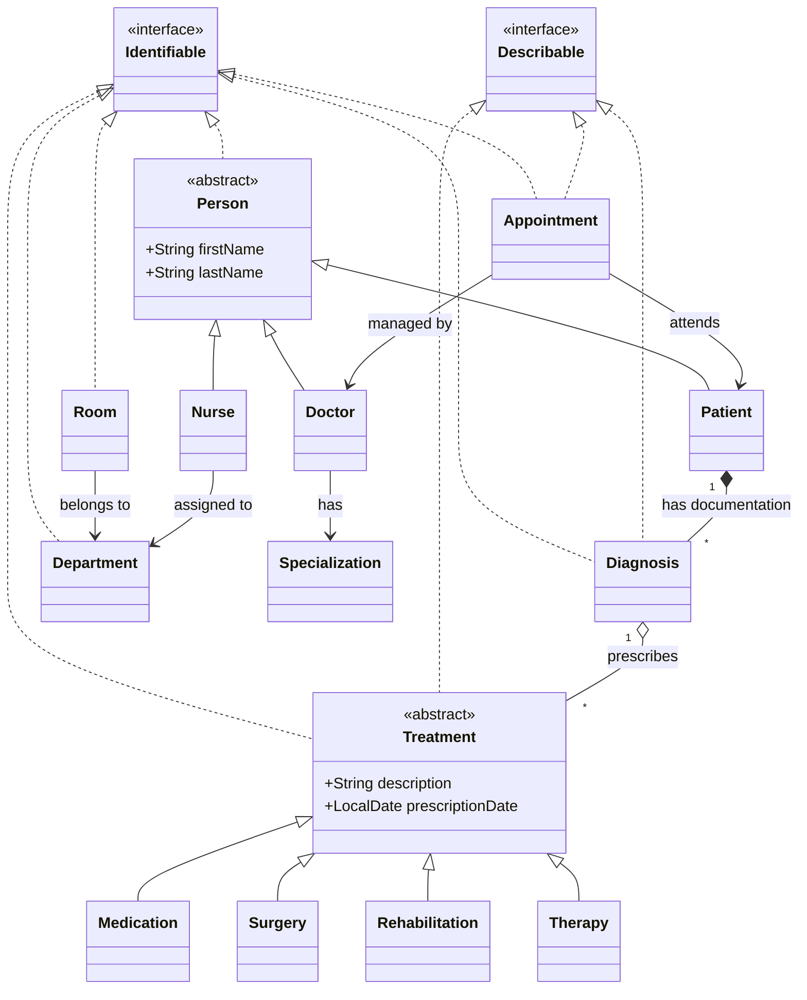

# Hospital Management System 🏥

> A robust, Java-based console application for comprehensive hospital resource management, designed with Clean Architecture principles and strict adherence to OOP best practices.

  

## 📋 Overview

The **Hospital Management System** is a modular application developed to streamline hospital operations. It facilitates the management of patients, medical staff (doctors, nurses), appointments, surgeries, and hospital infrastructure (departments, rooms). The system emphasizes data integrity, object-oriented design patterns, and "defensive programming" to ensure reliability in medical data handling.

## 🚀 Key Features

### 👨‍⚕️ Core Modules
*   **Patient Management**: Registration, medical history tracking (diagnoses, treatments), and comprehensive documentation access.
*   **Identity Resolution**: Implements a "search-first" workflow allowing users to query entities by name to retrieve unique identifiers (UUIDs). This ensures precision in operations like scheduling, eliminating ambiguity in case of duplicate names.
*   **Staff Coordination**: Management of Doctors (by specialization) and Nurses, including shift/department assignments.
*   **Appointment System**: Scheduling logic with conflict detection (no double-booking), status tracking (`SCHEDULED`, `COMPLETED`, `CANCELLED`), and historical logs.
*   **Infrastructure**: Real-time tracking of room occupancy and department resources.

### 🔄 Clinical Workflow (Smart Logic)
*   **Integrated Care Cycle**: The system enforces a strict medical workflow where **treatments, surgeries, and rehabilitations are prescribed exclusively during the Appointment Completion phase**.
*   **Comprehensive Health Reporting**: The diagnosis creation process serves as a formal health status report. Doctors document clinical findings and the patient's current condition in a detailed description field, creating a permanent record of the health assessment that drives further medical decisions.
*   **Diagnosis-Driven**: A doctor cannot prescribe a treatment without a diagnosis. Upon completing a visit, the doctor assigns a Diagnosis, which encapsulates all necessary follow-up procedures (medications, surgeries), ensuring full traceability.

### 🛠️ Technical Highlights
*   **Persistence**: Custom CSV-based persistence layer with transactional-like integrity checks (e.g., ensuring UUID consistency across files).
*   **Defensive Coding**: Strict validation logic in models (e.g., preventing duplicate diagnoses, validating chronological order of appointments).
*   **Advanced OOP**: Heavy use of polymorphism (e.g., `Treatment` hierarchy), encapsulation (immutable collections), and abstraction (`Identifiable`, `Describable` interfaces).
*   **Data Integrity**: Automated validation scripts ensuring referential integrity between 11+ interconnected CSV datasets.

## 🏗️ Architecture

The project follows a **Layered Architecture** to enforce separation of concerns:

1.  **Model Layer**: Rich domain models (`Patient`, `Doctor`, `Appointment`) containing business logic and validation rules.
2.  **Repository Layer**: Abstraction over file I/O operations, handling CSV parsing/writing and ensuring data consistency.
3.  **Service Layer**: Orchestration of business flows (e.g., "Schedule Appointment" involves checking doctor availability, patient status, and room slots).
4.  **UI/Console Layer**: User interaction handling, separated from business logic to allow potential future migration to GUI/Web.

### Class Diagram Snippet (Core)



## 📦 Data Structure (CSV)

The system operates on a relational-like CSV structure where entities are linked via **UUIDs**.

| File | Description | Key Relationships |
| :-- | :-- | :-- |
| `patients.csv` | Personal data \& history | Links to `diagnoses` (via ID list) |
| `appointments.csv` | Visit scheduling | Links to `patient_id`, `doctor_id`, `diagnosis_id` |
| `doctors.csv` | Medical staff profiles | Enum: `Specialization` |
| `nurses.csv` | Nursing staff | Links to `department_id` |
| `departments.csv` | Hospital units | Referenced by `rooms` and `nurses` |
| `rooms.csv` | Bed management | Links to `department_id`, `patient_ids` |
| `diagnoses.csv` | Medical conditions | Links to `treatment_ids` |
| `surgeries.csv` | Surgical procedures | Links to `doctor_id` |
| `medications.csv` | Prescribed drugs | Linked by `diagnoses` |
| `therapies.csv` | Therapeutic sessions | Linked by `diagnoses` |
| `rehabilitations.csv` | Rehab programs | Linked by `diagnoses` |

## 🔧 Setup \& Installation

1. **Clone the repository**

```bash
git clone https://github.com/adz1q/hospital-management.git
```

2. **Open in IDE**

   Import the project as a Gradle project in IntelliJ IDEA or Eclipse.

3. **Verify Java Version**

   Ensure you have **JDK 21** installed and configured in your path.

```bash
java --version
```

4. **Build**

```bash
./gradlew clean shadowJar
```

5. **Run**

```bash
java -jar build/libs/hospital-management-1.0-all.jar
```

## 🧪 Data Validation Strategy

The system implements a rigorous "integrity check" mechanism upon startup:

- **UUID Format Validation**: Prevents corrupted IDs (hex format check).
- **Referential Integrity**: Ensures every `doctor_id` in an appointment exists in the doctor registry.
- **Enum Consistency**: Validates that string values in CSVs match Java Enums (`SurgeryStatus`, `Specialization`).

## 👨‍💻 Author

**Adz1q**

_Java Developer_

---

_Project created for educational purposes, demonstrating advanced Java concepts and architectural patterns._
